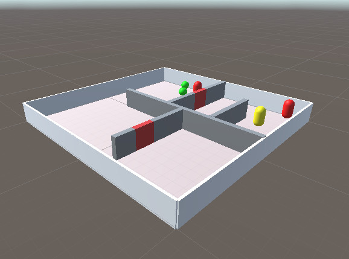

# Minigrid
A Unity-based environment to benchmark multi-agent pathfinding and cooperative behaviour.




# Road map
* [ ] Wassup latex?
* [x] Convert the project to C# SDK
* [ ] Assets for the environment
* [ ] Bugs in the envritonment: spawns, movement glitches etc.  
* [ ] Development documentation
* [ ] Instantianting scenes from `json`
* [ ] Add more envrionment configurations 
* [ ] Add baselines

## Installation

Unity version used ib development: `Unity 2022.3.4f1`, some tweaks are possible, `.NET` version 7

A good documentation page about how to install these — [click](https://learn.unity.com/tutorial/install-the-unity-hub-and-editor) \
Also, a Unity ML Agents Plug-in is needed to compile environments properly, their documentation is written well, in the official docs the aspect is covered — [click](https://github.com/alexunderch/ml-agents-patch/blob/develop/docs/Installation.md) 

>[NOTE]
The setup is insensitive to an OS if everything has been done right.

### Inference 

Via `pip` (tested on `python3.9`, `python3.10`)
```Bash
pip install -q mlagents==0.30.0 gdown
```
or from source
```Bash
git clone --single-branch https://github.com/alexunderch/ml-agents-patch.git ml-agents
python -m pip install -q ./ml-agents/ml-agents-envs
python -m pip install -q ./ml-agents/ml-agents
python -m pip install gdown
```

### Working with environment executables

Download one from the storage
```Bash
gdown 17amSPhxIe2mz14xb0XTJfiHpBiPoy1Ll
```
>[IMPORTANT]
Unzip to your working directory
```Bash
unzip dev_release.zip
```

The dir would have following structure (some elements were omitted intentionally)
```Bash
├── dev_release_BurstDebugInformation_DoNotShip
│   └── Data
├── dev_release_Data
│   ├── app.info
│   ├── boot.config
│   ├── globalgamemanagers
│   ├── globalgamemanagers.assets
│   ├── globalgamemanagers.assets.resS
│   ├── level0
│   ├── level0.resS
│   ├── Managed
│   ├── MonoBleedingEdge
│   │   ├── etc
│   │   └── x86_64
│   │       ├── libmonobdwgc-2.0.so
│   │       ├── libmono-native.so
│   │       └── libMonoPosixHelper.so
│   ├── Plugins
│   │   ├── lib_burst_generated.so
│   │   └── libgrpc_csharp_ext.x64.so
│   ├── Resources
│   │   ├── unity_builtin_extra
│   │   ├── unity default resources
│   │   └── UnityPlayer.png
│   ├── resources.assets
│   ├── RuntimeInitializeOnLoads.json
│   ├── ScriptingAssemblies.json
│   └── sharedassets0.assets
├── dev_release_s.debug
├── dev_release.x86_64 #the executable to be run
├── UnityPlayer_s.debug
└── UnityPlayer.so
```


### Development

TODO: add Unity/C# requirements

### Quick usage example
No other dependencies than installed ones, the file could be found in [./PythonAPI/minigrid_environment_example.py](./PythonAPI/minigrid_environment_example.py)
```Python

from mlagents_envs.environment import UnityEnvironment
from mlagents_envs.envs.unity_parallel_env import UnityParallelEnv

class GridEnv(UnityParallelEnv):
    def __init__(self, executable_path: str, seed: int | None = None, no_grahics: bool = True):
        """
        PettingZoo parallel API
        """
        self._worker_id: int = 0
        unity_env = UnityEnvironment(
                                    file_name=executable_path, 
                                    worker_id=self._worker_id, 
                                    seed=seed,
                                    no_graphics=no_grahics
                                    )
        
        super().__init__(unity_env, seed)


def test():
    executable_path = "path/to/executable.x86_64"

    env = GridEnv(executable_path=executable_path, seed=42, no_grahics=True)
    print("Action space:", env.action_spaces)
    print("Observation space:", env.observation_spaces)
    print("Reset Info\n", env.reset())    
    
    env.close() #important

if __name__ == "__main__":
    test()

```


## Brief environment description

This a multiagent environment designed particularly like a pathfinding goal-conditioned set of tasks. Agents need to find a goal and emerge cooperative/adversarial behaviour. The environment was designed using `Unity ML Agents` framework but to be compatible with its python API.

Essentially, we have the following observation/action spaces:

* `Observation space`: vector space is constructed via using rayscasting and shaped as
```
(Observation Stacks) * (1 + 2 * Rays Per Direction) * (Num Detectable Tags + 2)
```

>[Note] As for dev release it is 136-dimensional vector

* `Action space`: multi-discrete ([`gym.Spaces.MultiDiscrete`](https://gymnasium.farama.org/api/spaces/fundamental/#gymnasium.spaces.MultiDiscrete)), one is useful to represent game controllers or keyboards where each key can be represented as a discrete action space.
    - moving arrow keys: `0` – noop, `1` – W, `2` – A, `3` – S, `4` – D.
    - spinning action (rotations): `0` – noop, `1` – clockwise, `2` – anticlockwise    
    - jumping action: `0` – noop, `1` – vertical jump
    - attacking/goal-picking action (**not done yet**, maybe in the future)

* `Reward function` is a compostion of individual and cooperative reward fucntions, and it is done as follows:
    - Individual rewards:
        * An agent hit a wall = 
            - $-\frac{1 \cdot n\_\text{collisions}}{100}$ if one can move walls
            - $-10\frac{1 \cdot n\_\text{collisions}}{100}$ otherwise
        * An agent hit other agent =
            -  $-10$ if both agents can move walls, i.e. both are active
            - $+0$ otherwise
        * An agent hit a boundary = $-100$ to the agent
        * An active agent (i.e. can move walls) hit a goal = $+100$ to the agent
        * As the goal of an agent is to complete any given task as soon as possible, every agent is fined per step as $-\frac{1}{1+\text{ episode length}}$  
    - Cooperative rewards
        * All goals were completed = $+100$ to *each* agent.
    - Competitive rewards (**not done yet**)
        * Agent of a team "X" achived the goal (some goals) faster than the other team...

> [!NOTE]
Note that only cooperative behaviour is currently supported, competitve setting should be done in the nearest future.

* `Environment resets`: as `Unity ML Agents` mostly supports episodic environments, so the env. reset is possible due to:
    - completion of a given goal (episode termination)
    - exceeding the episode length (episode truncation)
    - one of the agents accidentally fell off the environment (episode truncation) 

> [!NOTE]
Note that resets are done deteministically according to inner (not inference) environment seed!

### Substrate
 Partially observable stochastic game $G = \langle \mathcal{I}, \mathcal{S}, \{\mathcal{A}\}_{i=1}^N, P,  \rho, \{R^i\}_{i=1}^N, \{\mathcal{O}^i\}_{i=1}^N, \{O^i\}_{i=1}^N, \gamma \rangle$:

* $\mathcal{I} = \{1, \ldots, N\}$ -- a finite set of agents;
* $\mathcal{S}$ -- a finite set of states;
* $\mathbf{A} = \prod_i \mathcal{A}^i = \mathcal{A}_1 \times \mathcal{A}_2 \times \ldots \times \mathcal{A}_N$ -- a joint state of actions, where $\mathcal{A}^i$ is an action space for the $i^{\text{th}}$ agent; 
* $\rho = \Delta(\mathcal{S})$ -- initial state distribution.
*  $\mathbf{O} = \prod_i \mathcal{O}^i =\mathcal{O}_1 \times \mathcal{O}_2 \times \ldots \times \mathcal{O}_N$ -- a joint observation space where $\mathcal{O}^i$ is the observation space for the $i^{\text{th}}$ agent.
* $O^i: \mathcal{S} \times \mathbf{A} \times \mathcal{O}^i \rightarrow \Delta(\mathcal{O}^i)$ -- an observation function of the $i^{\text{th}}$ agent, $\mathbf{O}: \mathcal{S} \times \mathbf{A} \times \mathbf{O} \rightarrow \Delta(\mathbf{O})$ -- an observation function for the joint observation.

The game proceeds as follows. The game starts in an initial state $s_0 \sim \rho$. At time $t$, an agent $i \in \mathcal{I}$ receives a private observation $o_t^i$ governed by the observation function, $O^i(o_t^i | s_{t+1}, \mathbf{a}_t)$, and chooses an action $a^i_t \in \mathcal{A}^i$ and executes it simultaneously with all other agents. Each action can be denoted as $\mathbf{a} = (a^i, a^{-i})$ where $\cdot^{-i}$ denotes actions of all but the $i^\text{th}$ agent.

* Given the state $s_t$ and agents' joint action $\mathbf{a}_t = \{a^i_t\}$, the environment transitions to the next state according to the state transition function $P(s_{t+1}|s_t, \mathbf{a}_t): \ \mathcal{S} \times \mathbf{A} \times S \rightarrow \Delta(S)$.
* for the agent reward function is defined as $r_t^i = R^i(s_{t+1}, \mathbf{a}_t, s_{t}): \mathcal{S} \times \mathbf{A} \times \mathcal{S} \rightarrow \mathbb{R}$.
Each agent aims to find a behavioural policy $\pi^i(a^i_t|h^i_t) \in \Pi^i: \mathcal{T} \rightarrow \Delta(\mathcal{A}^i)$ conditioned on action-observation history $h_t = (s_0, \mathbf{o}_0, \mathbf{a}_0, s_1,  \mathbf{o}_1, \mathbf{a}_1, \ldots, s_t, \mathbf{o}_t) \in \mathcal{T} = (\mathcal{S} \times \mathbf{A} \times \mathbf{O})^*$ that can guide the agent to take sequential actions such that the discounted cumulative reward of the joint policy $\pi = (\pi^i, \pi^{-i})$ is maximised:$$
  \pi \in  \arg \max_{\pi}  \mathbb{E}_{s_{t+1} \sim P(\cdot|s_t, \mathbf{a}_t), \ \mathbf{o}_t \sim \mathbf{O}(\mathbf{o}_t | s_{t+1}, \mathbf{a}_t), \ a^{-i}_t \in \pi^{-i}(\cdot|h^{-i}_t) } \left[ \sum_{t\geq 0} \gamma^t r^i_{t+1}| s_0 \sim \rho, a^i_t \sim \pi^i(\cdot|h^i_t)  \right]$$
where $\gamma \in [0, 1)$ -- a discount factor. 

## Environment configuration 

TODO: add pictures and more detailed descriptions

### Agents
Could be distinguished with 2 roles implemented: `active` and `passive`. These two are different in game mechanics: an active agent can move obstacles and achieve goals, or emerge behaviour, whereas a passive agent can only move across the environment and hint the active agent that the goal could be nearby.

Each agent is described with the following structure
```yaml
Agent: MAPFAgent
StartingPosition: Vector3
StartingRotation: Quaternion
Type: Active/Passive
```

### Obstacles

Could be movable and immovable, those are different with colouring. Only active agents could move obstacles. 

Obstacles could be extended to complex primitives but for a whille being designed as
```yaml
Wall: WallElement
StartingPosition: Vector3
StartingRotation: Quaternion
Type: Movable/Immovable
```

### Goals
Goals are need to be triggered to be completed. A completed goal changes its colour, and it could only be done by an active agent. To solve the environment, agents need to complete all the goals there. 

Goal are represented using the following structures
```yaml
Goal: GoalBehaviour
StartingPosition: Vector3
StartingRotation: Quaternion
Type: Sphere/Cube/Whatever
```

## Create and save environments using config. files

>[IMPORTANT]
By design, any maps with any given seed could be saved to json and recovered back. However, as we work with executables *mostly* for Python API, so this part could be helpful for development. 

### `json` files format
A config sketch (the file could be found in [./configs/maps/dev_map.json](./configs/maps/dev_map.json)):
```
{
    "Agents":
    {
        Name:
        {
            "Position": Vector3
            "Rotation": Quaternion
            "Type": String
        }, ...    
    },
    "Goals":
    {
        Name: 
        {
            "Position": Vector3
            "Rotation": Quaternion (if needed)
            "Type": String
        }, ...
    },
    "Map":
    {
        "Size": Vector2,
        "BaseBlockScale": Vector3,
        "Walls":
        {
            Name: 
            {
                "Position": Vector3
                "Rotation": Quaternion 
                "Type": String
            }, ...
        }
    }
}
```

## Similar things 
1. https://madrona-engine.github.io/
2. https://www.megaverse.info